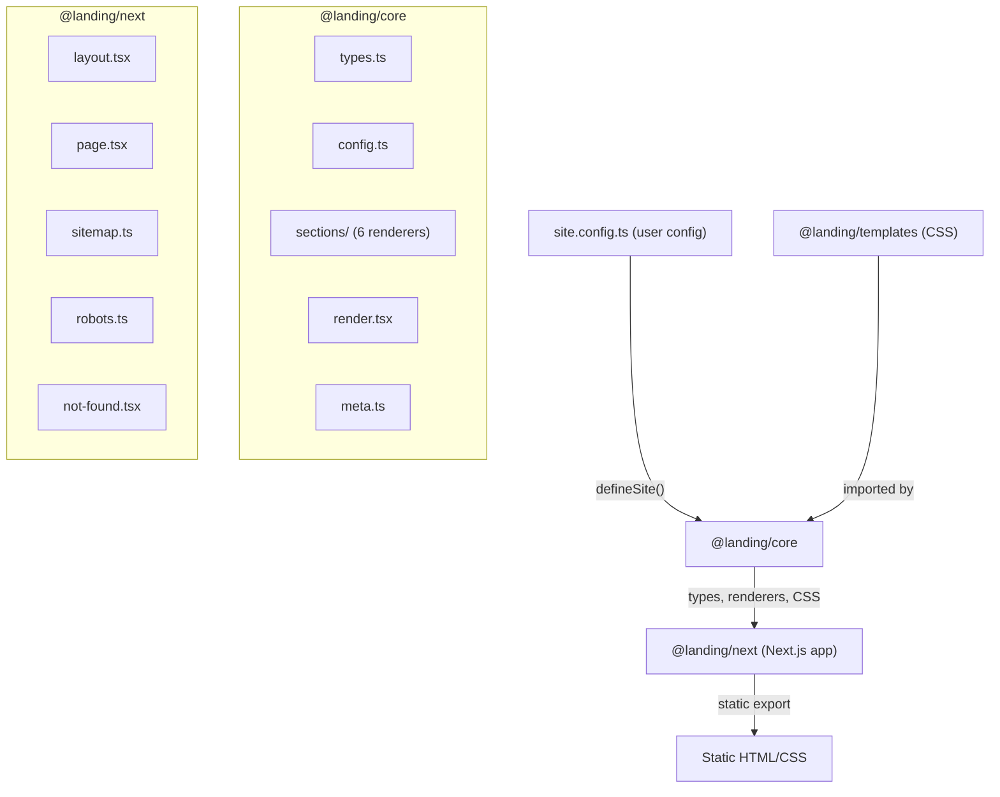
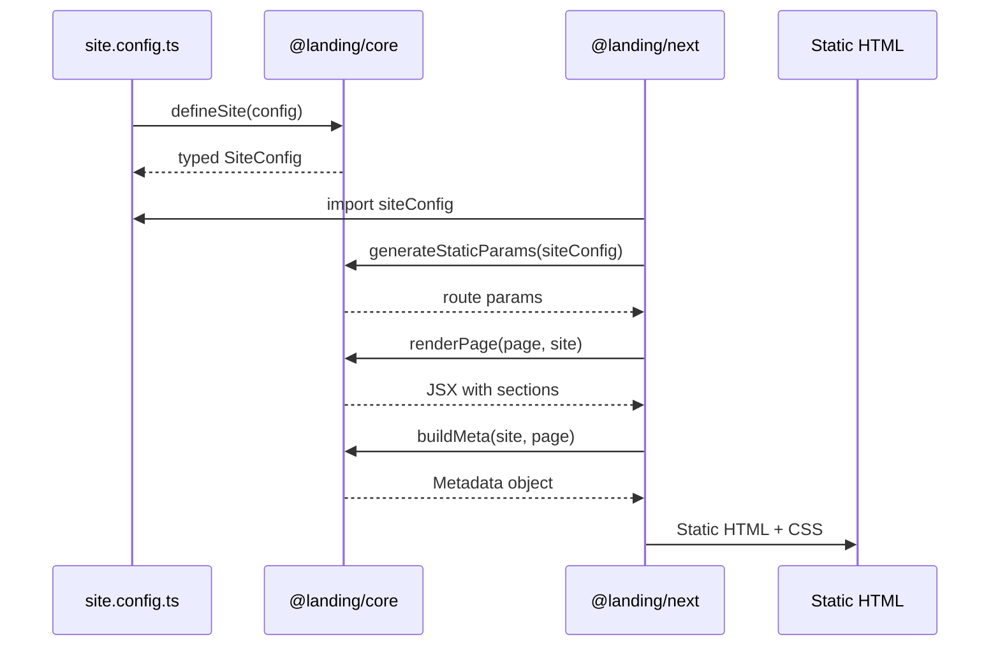

# Complete the landing-kit Framework

## Architecture

## 1. Monorepo Setup

**Root `package.json**` -- add npm workspaces and scripts:

- `"workspaces": ["packages/*", "examples/*"]`
- Scripts: `dev`, `build`, `lint` (delegate to `packages/next`)

**Root `tsconfig.json**` -- add JSX, path references for the monorepo.

## 2. Core Package (`packages/core/`)

Delete existing `[packages/core/index.ts](packages/core/index.ts)` and `[packages/core/lib.tsx](packages/core/lib.tsx)` -- they are stubs with incorrect exports.

Create new structure:

- `**src/types.ts**` -- All TypeScript interfaces:
  - `SiteConfig` (meta, pages, analytics)
  - `MetaConfig` (title, description, ogImage, favicon, url)
  - `PageConfig` (title, description, sections)
  - `SectionConfig` -- discriminated union of all section types
  - Individual section types: `HeroSection`, `FeaturesSection`, `PricingSection`, `CtaSection`, `FaqSection`, `FooterSection`
- `**src/config.ts**` -- `defineSite(config: SiteConfig): SiteConfig` -- type-safe identity function that validates shape
- `**src/sections/**` -- React server components (no client JS):
  - `hero.tsx` -- heading, subheading, CTA buttons, background
  - `features.tsx` -- grid of feature cards (icon emoji, title, description)
  - `pricing.tsx` -- pricing tier cards (name, price, period, feature list, CTA)
  - `cta.tsx` -- call-to-action banner (heading, description, button)
  - `faq.tsx` -- collapsible Q&A using `
/
` (CSS-only, no JS)
  - `footer.tsx` -- link columns, copyright text
  - `index.ts` -- `renderSection(section: SectionConfig)` dispatcher
- `**src/render.tsx**` -- `renderPage(page: PageConfig, site: SiteConfig): JSX.Element` -- iterates page.sections, calls renderSection for each
- `**src/meta.ts**` -- `buildMeta(site: SiteConfig, page: PageConfig): Metadata` -- returns Next.js Metadata object with title, description, Open Graph, Twitter cards
- `**src/index.ts**` -- Public API barrel: exports `defineSite`, all types, `renderPage`, `buildMeta`, `renderSection`
- `**package.json**` -- `"name": "@landing/core"`, peer deps on react

## 3. CSS Styles (in `packages/core/styles/`)

CSS-only templates as mentioned in the README. No CSS-in-JS, no Tailwind. Clean semantic CSS with CSS custom properties for theming.

- `base.css` -- CSS reset, custom properties (--color-primary, --color-bg, --font-family, spacing scale), responsive breakpoints
- `hero.css`, `features.css`, `pricing.css`, `cta.css`, `faq.css`, `footer.css` -- section-specific styles using BEM-like class names (e.g., `.lk-hero`, `.lk-hero__heading`)
- `index.css` -- imports all CSS files

## 4. Templates Package (`packages/templates/`)

- `**package.json**` -- `"name": "@landing/templates"`
- `**default.css**` -- The default theme CSS (re-exports core styles with default custom property values)
- This package is kept minimal for now; the README mentions it so we create the skeleton with the default template

## 5. Next.js Package (`packages/next/`)

Restructure from current layout-inside-catch-all to proper Next.js App Router structure.

- `**package.json**` -- `"name": "@landing/next"`, depends on `@landing/core`, `next`, `react`
- `**next.config.ts**` -- `output: "export"` for static generation, typescript paths
- `**tsconfig.json**` -- extends root, adds Next.js types and path aliases
- `**site.config.ts**` -- bridge file that imports from `../examples/basic/site.config` (indirection layer for config loading)
- `**app/layout.tsx**` -- root layout: imports CSS from core, adds Google Analytics `<script>` when configured, `<html>`, `<body>`
- `**app/[[...slug]]/page.tsx**` -- `generateStaticParams()` from config pages, `generateMetadata()` via `buildMeta()`, default export renders via `renderPage()`
- `**app/not-found.tsx**` -- styled 404 page
- `**app/sitemap.ts**` -- generates `sitemap.xml` from config pages + site URL
- `**app/robots.ts**` -- generates `robots.txt` allowing all crawlers, linking to sitemap

Move `layout.tsx` from `app/[[...slug]]/layout.tsx` to `app/layout.tsx` (root-level).

## 6. Example Site (`examples/basic/`)

Replace `examples/vite/` with `examples/basic/`:

- `**site.config.ts**` -- comprehensive example using ALL 6 section types across 2-3 pages:
  - `/` (home): hero, features, pricing, cta, faq, footer
  - `/about`: hero (different), features, cta, footer
  - `/pricing`: hero, pricing, faq, footer

This serves as both the working example and a demo of the framework's capabilities.

## 7. Config Loading Flow

## Key Design Decisions

- **CSS-only interactivity**: FAQ uses native `
/
`, no client-side JavaScript needed for any section
- **Server Components only**: All section renderers are React Server Components (no `"use client"`)
- **BEM-like class naming**: `.lk-{section}`, `.lk-{section}__{element}` to avoid collisions
- **CSS custom properties**: Theming via `--lk-color-primary`, `--lk-color-bg`, etc. in `:root`
- **Static export**: `next.config.ts` uses `output: "export"` for zero-server deployment

